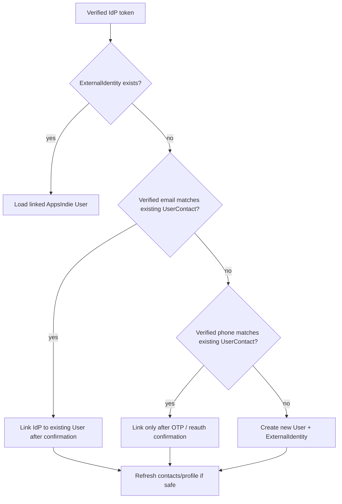
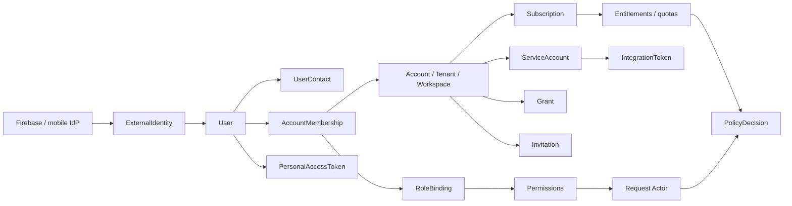
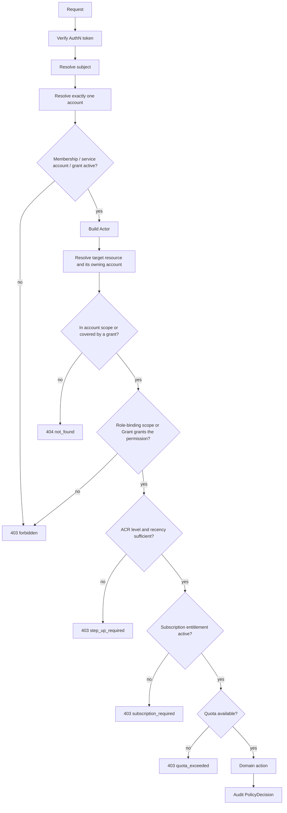
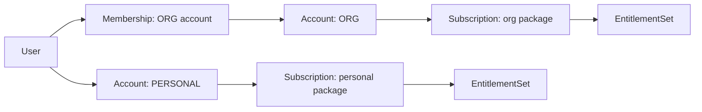
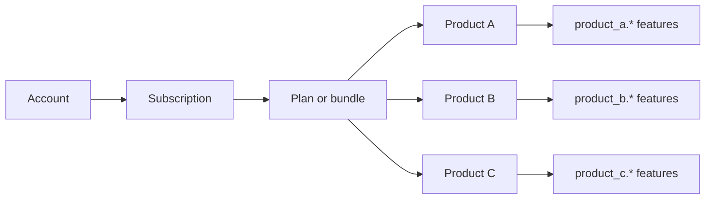

<!-- id: note-7ea7e212cfcd4a288d4c882bac4aa10d | name: AppsIndie Access, Identity & Subscription Governance Pattern | author: user | scope: When designing or implementing AppsIndie authentication, authorization, multi-tenant access control, RBAC, subscription/entitlement, user onboarding/offboarding, service-account integrations, API trust boundaries, or tenant scoping -->

# AppsIndie — Product-Agnostic User, Access & Subscription Governance Pattern

**Status:** proposed  
**Scope:** a reusable guardrail for identity, onboarding/offboarding, multi-account RBAC, subscription/entitlement, personal access tokens, service-account integrations, API surfaces, ACR, and gateway options. This paper defines the shared AppsIndie pattern. Each product should adopt, extend, or customize the role names, permission catalog, domain resources, subscription packages, and UI flows for its own needs.  
**Target phases:** MVP foundational work; PAT/service-account integration API in late MVP / MMP.  

---

## 1. Goals

1. One global identity for every human (`User`) while keeping account membership explicit and revocable.
2. Three clean API trust boundaries:
   - `client-api` — Firebase/IdP-token callers from product web or mobile apps.
   - `service-api` — internal backend services / workers.
   - `integration-api` — partner/external callers authenticating with a service-account token or account-scoped PAT.
3. Products can define their own default roles, custom roles, and permission catalog without changing the shared authorization kernel.
4. System admin and account admin are powerful by design but still auditable and account-scoped.
5. Zero ambiguity about which account a request operates on.
6. Authentication remains mobile-friendly and replaceable: Firebase, Cognito, Auth0, Apple/Google sign-in, passkeys, or a future custom IdP can all feed the same AppsIndie authorization kernel.

---

## 1.1 Recommended AppsIndie access kernel

The product may call the boundary a `Tenant`, `Workspace`, `BusinessAccount`, `PropertyGroup`, `Clinic`, `Shop`, or something else. Internally, AppsIndie should standardize one reusable access kernel:

| Kernel concept | Meaning | Product examples |
|---|---|---|
| `Subject` | The caller identity after AuthN | user, guest, system admin, service account, integration |
| `Account` / `Tenant` | The isolation and billing boundary | org account, personal host account, personal retail account |
| `Membership` | A subject's relationship to an account | account admin, staff, guest, retail member |
| `RoleBinding` | Assigned authority inside an account | default role, custom role, support role |
| `Entitlement` | Subscription-derived capabilities and limits | premium business, retail premium, external integration |
| `Actor` | Request-scoped resolved identity | subject + active account + permissions + grant ids |
| `PolicyDecision` | Auditable allow/deny result | `allowed`, `forbidden`, `not_found`, `subscription_required`, `account_required` |

Firebase or another IdP should own **authentication** only. AppsIndie owns **authorization**: users, accounts, memberships, roles, service accounts, entitlements, resource ownership, and audit.

### 1.1.1 How a product should adopt this paper

This document is not meant to prescribe every product's exact role names or permission list. It is a pattern paper:

| Layer | Shared by AppsIndie | Product decides |
|---|---|---|
| Identity | `User`, `ExternalIdentity`, `UserContact` | Required profile fields, onboarding copy |
| Account boundary | `Account` kernel, membership lifecycle | Product-facing name and domain-specific account metadata |
| Authorization | `Actor`, roles, permissions, grant policy, `PolicyDecision` | Default roles, permission names, custom-role UX |
| Entitlements | `Plan`, `Feature`, `Subscription`, quota checks | Monetization mode (§9.0), product packages, feature names, limits, trials |
| API trust | client/service/integration surfaces | Exact routes, controllers, mobile/web screens |
| Audit | Who did what, where, why, and result | Product-specific audit event names and retention |

Adoption rule:

1. **Adopt** the shared kernel concepts and security invariants.
2. **Choose the monetization mode** (§9.0) before Phase 1, because ungated and free-plan products build different tables.
3. **Extend** with product-specific resources, permissions, features, and quotas.
4. **Customize** naming and UX to fit the product.
5. **Avoid forking** identity, account membership, token validation, policy decisions, and audit unless the product has a strong isolation reason.

---

## 2. Core identity model

```
User (global)
  ├─ id (AppsIndie-owned UUID/ULID), primaryEmail, primaryPhone, displayName
  ├─ status (active|pending|deactivated)
  └─ createdAt, createdBy, deactivatedAt, deactivatedBy

ExternalIdentity
  ├─ id, userId, provider (firebase | cognito | auth0 | apple | google | custom)
  ├─ providerTenantId / projectId, providerSubject (e.g. Firebase uid)
  ├─ emailAtProvider, emailVerified, phoneAtProvider, phoneVerified
  └─ linkedAt, lastLoginAt

UserContact
  ├─ id, userId, type (email | phone), valueNormalized
  ├─ verified, source (idp | user | admin), isPrimary
  └─ verifiedAt, createdAt

Account
  ├─ id, kind (PERSONAL | ORG), name, contactEmail, contactPhone
  ├─ status (active | suspended | deactivated), policies...
  ├─ ownerUserId (PERSONAL only; immutable)
  └─ createdAt, createdBy, deactivatedAt, deactivatedBy

AccountMembership
  ├─ id, userId, accountId, status
  ├─ invitedBy, invitedAt, acceptedAt, deactivatedAt
  └─ primary flag (used when a user has only one active membership)

Role
  ├─ id, accountId (null for platform roles), name, isSystem
  └─ permissions[]

RoleBinding
  ├─ id, subjectType (USER | SERVICE_ACCOUNT), subjectId, accountId, roleId
  ├─ scopeType (ACCOUNT | GROUP | RESOURCE), scopeId (null for ACCOUNT)
  └─ grantedBy, grantedAt, expiresAt, revokedAt

PlatformRoleAssignment
  ├─ id, userId, roleId
  └─ grantedBy, grantedAt, expiresAt, revokedAt

Grant
  ├─ id, accountId (owning account of the resource), subjectId (optional before claim)
  ├─ subjectAccountId (optional; grantee's own account, indexed for "my orders" queries)
  ├─ claimTokenHash (optional), resourceType, resourceId, relation
  ├─ permissions[], source (INVITE | SHARE | SUPPORT | PARTNER)
  └─ createdBy, expiresAt, claimedAt, revokedAt

AuthorizationVersion (two independent counters; cache keys use both)
  ├─ scopeType (ACCOUNT | SUBJECT), scopeId    // unique(scopeType, scopeId)
  ├─ version
  └─ updatedAt

AuditEvent (append-only)
  ├─ id, occurredAt, decisionId, outcome, reason, catalogVersion
  ├─ subjectId, userId, actorKind, accountId, productId
  ├─ action, resourceType, resourceId, roleBindingIds[], grantIds[]
  ├─ authMethod, acr, authTime, tokenId/serviceAccountId
  └─ requestId, sourceIp, userAgent, metadata (redacted)

PersonalAccessToken
  ├─ id, userId, accountId (null = user-scoped), name
  ├─ tokenHash, scopes[] (permissions or role references)
  ├─ expiresAt, revokedAt, lastUsedAt, createdBy
  └─ allowedIps[] (optional)

ServiceAccount
  ├─ id, accountId, name, status
  ├─ permissions[] or roleIds[], allowedIps[]
  └─ createdBy, revokedAt, lastUsedAt

IntegrationToken
  ├─ id, serviceAccountId, tokenHash, prefix, last4
  ├─ expiresAt, revokedAt, lastUsedAt
  └─ rateLimitPolicyId

Invitation
  ├─ id, accountId, invitedEmailNormalized, roleIds[], status
  ├─ scopeType (ACCOUNT | GROUP | RESOURCE), scopeId (null for ACCOUNT)
  ├─ tokenHash, expiresAt, acceptedAt, revokedAt
  └─ invitedBy, acceptedByUserId
```

`RoleBinding.scopeType` is included from the start, even if an MVP creates only `ACCOUNT` bindings. This avoids redesigning every authorization call when a product later needs branch-, site-, project-, group-, or resource-scoped roles.

### 2.1 Identity provider linking and duplicate resolution

Do **not** use Firebase uid as `User.id`. Keep `User.id` as an AppsIndie-owned stable id and map each login provider through `ExternalIdentity`.

Why:

1. AppsIndie may later support multiple Firebase projects, Apple/Google sign-in, Auth0/Cognito, B2B SSO, passkeys, or custom AuthN.
2. An IdP account can be deleted/recreated while AppsIndie domain data should remain stable.
3. Authorization state lives in AppsIndie, not in Firebase custom claims.

Login/linking flow:



Conflict rules:

1. `provider + providerTenantId + providerSubject` is unique and maps to one `User`.
2. Verified email can find an existing user; unverified email cannot auto-link.
3. Verified phone can find an existing user, but require OTP or re-auth confirmation because phone numbers can be recycled.
4. `displayName` is never an identity key. It is mutable profile data only.
5. IdP claims may fill empty AppsIndie fields, but must not overwrite user-edited or admin-verified AppsIndie fields unless the user explicitly confirms.
6. If multiple users match the same verified contact, block auto-link and require support/manual merge.

For MVP, if there is exactly one Firebase project and no SSO, `ExternalIdentity` can still be a small table with only `provider = firebase`, `providerProjectId`, and `providerSubject`. That keeps the future path open without adding much complexity.

Account merge guardrail:

- Never auto-merge when more than one AppsIndie user matches a verified contact.
- A support/admin merge requires fresh MFA, explicit source and target users, a preview of conflicts, and an audit event.
- In one transaction, move non-conflicting `ExternalIdentity`, `UserContact`, memberships, grants, and PAT ownership to the target user; revoke source sessions/tokens.
- Preserve the source user as a deactivated alias/tombstone pointing to the target so audit history remains interpretable.
- Conflicting identities, personal accounts, purchases, or legal/compliance holds require product-specific manual resolution.

### 2.2 Actor (request-scoped)

```java
record Actor(
    String subjectId,           // user id, grant claimant id, service account id, or platform actor id
    String userId,              // global user id when the subject is a human; null for service accounts
    String accountId,           // resolved account/workspace for this request; null only for platform endpoints
    ActorKind kind,             // PLATFORM | MEMBER | GRANTEE | SERVICE | INTEGRATION
    Set<String> permissions,    // platform roles + ACCOUNT-scoped bindings only; never GROUP/RESOURCE
    Set<String> roleBindingIds, // active bindings evaluated against the requested resource
    Set<String> grantIds,       // resolved, queryable Grant records; not free-form strings
    int acr,                    // 0..3, see §10
    Instant authTime,           // when the current authentication/step-up happened
    Instant expiresAt           // token expiry (useful for PAT / integration token)
) {}
```

`can(permission)` logic:

```java
if (permissions.contains("platform.*") && permission.startsWith("platform.")) return true;
if (permission.startsWith("platform.")) return false;   // account wildcards never grant platform permissions
if (accountId == null) return false;
if (permissions.contains("*")) return true;             // account admin only inside the resolved account
if (permissions.contains(permission)) return true;
// wildcard match: "resource.*" grants "resource.read"
return permissions.stream().anyMatch(p -> p.endsWith(".*") && permission.startsWith(p.substring(0, p.length() - 1)));
```

How `Actor.permissions` is built is part of the security contract, not an implementation detail:

- It contains permissions from platform roles and from `RoleBinding` rows with `scopeType = ACCOUNT`.
- It **never** contains permissions from `GROUP`- or `RESOURCE`-scoped bindings, nor permissions carried by a `Grant`. Those are evaluated only by `authorize(actor, permission, resource)` (§4.3.2), which resolves them against the specific target resource.

`can(permission)` is therefore valid only for platform actions and account-wide actions after account resolution. Merging a scoped binding into the flattened set would silently promote a branch-level role to account-level authority — the exact escalation that scoped bindings exist to prevent.

Cases C1 through C3 of the conformance suite (§4.7) exist to hold this invariant in place: a subject holding only a `GROUP`-scoped role must fail `can(permission)` for the account-wide action and pass `authorize(actor, permission, resource)` only for resources inside that group.

The `Actor` is only an input to policy evaluation. The final answer should be a `PolicyDecision` so denials are consistent and auditable:

```java
record PolicyDecision(
    boolean allowed,
    String reason,       // allowed | account_required | not_found | forbidden | subscription_required | step_up_required | quota_exceeded
    String permission,
    String featureId,
    String catalogVersion,
    String auditId
) {}
```

### 2.2.1 Visual model



### 2.3 System admin

- Stored through `PlatformRoleAssignment`, not through `AccountMembership`.
- Created only by another system admin or by a one-time bootstrap flow.
- Global actor with `kind = PLATFORM`, `permissions = ["platform.*"]`, and **no `accountId` unless explicitly acting on one**.
- Can list accounts and create accounts through platform endpoints.
- For account support, the admin must enter an explicit **support context** implemented as a short-lived `Grant` with `source = SUPPORT`, `accountId`, support reason/ticket, exact permissions, expiry, and audit record.
- Support grants never use bare `*`; products define a support permission set. Account-scoped support actions remain subject to account entitlements and resource scope.
- Onboarding:
  1. Existing system admin invites email.
  2. Invitee signs in with Firebase (email/password + optional MFA).
  3. `User` + `PlatformRoleAssignment` with system role `SYSTEM_ADMIN` created.
- Offboarding:
  1. Revoke `PlatformRoleAssignment`; deactivate the global `User` only when the person should lose all products/accounts.
  2. Revoke all PATs and platform support sessions.
  3. Cannot deactivate the last system admin without another active one.

### 2.4 Account admin

- Use one privileged account admin role. This paper calls it `ACCOUNT_ADMIN`; products may rename it to `ORG_ADMIN`, `WORKSPACE_ADMIN`, or a product-specific name.
- The first user of an account becomes an account admin.
- Account admins have `permissions = ["*"]` **within that account only**.
- An account may have multiple admins. The last active account admin cannot be deactivated unless another active account admin exists or a system admin performs a first-class audited recovery action.
- Onboarding:
  1. Account admin creates an `Invitation` with role ids, binding scope (`ACCOUNT` by default, or a `GROUP`/`RESOURCE` scope for site- or project-level staff), normalized invited email, expiry, and hashed single-use token.
  2. Email contains an accept link that signs the user into Firebase/IdP.
  3. Backend verifies the token is unused/unexpired/unrevoked and the accepting verified email matches `invitedEmailNormalized`.
  4. Backend creates `User` if missing, creates `AccountMembership` plus `RoleBinding` rows at the invited scope, marks the invitation accepted, and emits audit in one transaction.
- Offboarding:
  1. Account admin deactivates the membership. The global `User` remains.
  2. All account-scoped PATs for that user are revoked. Account service accounts remain active unless an account admin revokes them separately.
  3. The last active account admin check must run in the same transaction with a lock on the account row to prevent concurrent removals.

### 2.5 Account users (staff/members)

- One `User` can belong to **many accounts** with **many roles per account**.
- Role resolution at request time unions permissions from active `ACCOUNT`-scoped role bindings only. `GROUP`- and `RESOURCE`-scoped bindings stay out of `Actor.permissions` and are evaluated per resource by `authorize(...)` (§2.2, §4.3.2).
- Onboarding/offboarding flow is the same as §2.4, just with a non-admin role.

### 2.6 Resource grants and guests

- Use one `Grant` mechanism for guest access, resource sharing, support context, and partner-scoped access.
- Before claim, `Grant.claimTokenHash` represents a single-use magic link/reference claim. After verification it is bound to `subjectId`.
- A grant is account- and resource-scoped, permission-limited, expiring, revocable, listable, and auditable.
- Verified email may help identify the claimant but is not sufficient proof by itself.
- A person who later becomes staff/admin receives a separate `AccountMembership`; the resource grant may remain or be revoked independently.
- The authorizer resolves active grant ids into the `Actor`. Product queries use the grant's `resourceType`, `resourceId`, and relation rather than free-form actor constraint strings.
- A grantee acts **inside the owning account**, so entitlement checks resolve from that account's subscription, not the grantee's. A consumer's access to a record they participate in therefore follows the provider's plan status; `expired` still permits reads (§9.2). State this in product UX so a lapsed provider subscription does not look like consumer data loss.

### 2.7 Consumer, host, and business account shapes

Use one account model instead of separate public/B2C/business account shapes:

| Use case | Account shape | Membership |
|---|---|---|
| B2C retail consumer | `Account(kind = PERSONAL, ownerUserId = user.id)` | One explicit `AccountMembership` plus one `ACCOUNT`-scoped admin `RoleBinding` |
| B2C host / one-person business | Same `PERSONAL` account, with host/business features enabled | The user remains `ACCOUNT_ADMIN` of the same account |
| B2B / B2B2C business | `Account(kind = ORG)` | One or more users have memberships and roles |

Why:

1. Every resource is scoped by `accountId`, so consumer isolation uses the same rule as business isolation.
2. There is no shared consumer account and no special `ownerId` filter that every query must remember.
3. Retail and business subscriptions can both be represented as `Subscription(accountId)`.
4. A consumer becoming a solo host is an entitlement/package change on their `PERSONAL` account.
5. A user can belong to multiple accounts: their personal account, one or more org accounts, and resource grants.
6. A `PERSONAL` account holds exactly one active membership — its owner. Inviting a second person requires converting the account to `ORG` (below). This keeps `ownerUserId` meaningful and avoids a personal account that no one can transfer or bill as a team.

No-account sign-in:

- If consumer mode is enabled, first sign-in creates `User`, `Account(kind = PERSONAL)`, and `AccountMembership`. In free-plan mode it also creates a `Subscription(accountId)` at the seeded free plan version; in ungated mode it creates no subscription (§9.0).
- That auto-creation is an abuse surface: it mints an account and a subscription for anyone who can complete a sign-in. Require app/device attestation (Firebase App Check, Play Integrity, or equivalent), rate-limit account creation per device and IP, and define a one-trial-per-user/device/payment-method rule before enabling paid trials.
- If only invited/business mode is enabled, first sign-in without membership returns `403 no_account_membership`.
- If the user later creates a business, create `Account(kind = ORG)` and make the user `ACCOUNT_ADMIN` of that org account.

Personal-to-org growth:

- **Create separate ORG account** when the user should retain an independent personal/retail context. Personal and org subscriptions remain separate.
- **Convert in place** when a solo creator/host account itself becomes a team: change `Account.kind` from `PERSONAL` to `ORG`, clear `ownerUserId`, preserve `accountId`, resources, grants, and the user's admin role binding. No resource migration occurs.
- A PERSONAL account funded through IAP cannot carry that purchase into an ORG subscription. Conversion requires web/org billing, cancellation or expiry of the IAP purchase, and product-defined proration/refund handling.
- The conversion transaction must create/verify an active account-admin binding and satisfy org billing policy before committing.

### 2.8 Two-sided B2B2C resources

Every resource has exactly one primary owning `accountId`. Other participants access it through `Grant`.

Default marketplace rule:

1. The provider/seller/business account owns the booking, order, appointment, case, or equivalent record.
2. The consumer's personal account/user receives a grant with a relation such as `BUYER`, `GUEST`, `PATIENT`, or product-defined equivalent.
3. Provider screens query resources by owning `accountId`.
4. Consumer "my resources/orders/bookings" screens query grants by `Grant.subjectId`, or by `Grant.subjectAccountId` when the participant is represented by their personal account, then join to the resource. Index whichever column the product uses; this is a different read path from the provider's, with its own pagination and cache behaviour.
5. A product may choose a platform-owned account for marketplace records, but it must document that choice and still represent both sides through grants.

This keeps the account isolation rule intact while explicitly supporting records shared across B2B and B2C participants.

---

## 3. Onboarding / offboarding summary

| Actor | Onboarded by | Activation | Offboarding | Side effects |
|---|---|---|---|---|
| System admin | Bootstrap / another system admin | Firebase sign-in + platform role assignment | Deactivate `User`, revoke PATs/support sessions | Must keep ≥1 active system admin |
| Account admin | System admin creates account, self-signup + approval, or another account admin invites | Accept invite | Deactivate membership, except last active account admin | Revoke account-scoped PATs owned by that user |
| Account staff | Account admin | Accept invite | Deactivate membership | Reassign open tasks/exceptions first |
| Guest | Product workflow or self sign-up | Firebase/IdP sign-in plus product-specific access claim | Automatic after retention period | Deleting a guest does not delete business records; only personal contact info is purged |
| B2C consumer | Self sign-up or B2C invitation | Auto-create personal `Account(kind = PERSONAL)` with default subscription | Deactivate account or membership | Personal data is scoped by `accountId` |
| B2C host | Self sign-up or upgrade from consumer | Enable host/business features on personal account, or create `Account(kind = ORG)` | Deactivate account or membership | Can downgrade features or close account |

---

## 4. Permission & role model

### 4.1 Permission naming

Permissions are product-defined. The shared pattern only requires consistent naming and centralized enforcement.

Recommended shape:

```
{resource}.{action}
{resource}.{subresource}.{action}
{product}.{resource}.{action}        // useful when one AuthZ instance supports multiple products
```

Generic examples:

```
account.settings.read
account.settings.write
member.read
member.manage
role.read
role.manage
billing.read
billing.manage
integration.read
integration.enable
token.create
audit.read
resource.read
resource.write
resource.read_self
resource.write_self
```

A permission ending with `.*` grants every action on that resource, e.g. `resource.*` grants `resource.read` and `resource.write`. Products should define their own concrete domain permissions, e.g. booking, invoice, document, campaign, clinic, shop, device, order, or report permissions.

### 4.2 Role kinds

The shared pattern defines categories, not product-specific role names:

| Category | Source | Product decides |
|---|---|---|
| Platform roles | Seed migration / platform admin | Names such as `SYSTEM_ADMIN`, support roles, break-glass roles |
| Account admin role | Seed migration / product onboarding | Whether to call it `ACCOUNT_ADMIN`, `WORKSPACE_ADMIN`, `ORG_ADMIN`, etc. |
| Product default roles | Seeded by each product | Examples: manager, operator, finance, support, technician, viewer |
| Custom account roles | Created by account admin | Whether custom roles are enabled, editable, cloneable, or plan-gated |

The only required shared role is one product/account admin role with full authority inside the resolved account boundary. This paper uses `ACCOUNT_ADMIN` as the neutral placeholder, but products may rename it.

### 4.3 Product-scoped permission catalog

Not every permission should be grantable by an account admin. Each product should expose a whitelist of permissions that can appear in custom roles.

Generic catalog shape:

| Permission group | Product fills in | Notes |
|---|---|---|
| Resource access | `resource.read`, `resource.write`, `resource.*` | Domain resources differ by product |
| Self access | `resource.read_self`, `resource.write_self` | Optional product shorthand for resources related to the current subject |
| Account settings | `account.settings.read/write` | Sensitive writes should require ACR step-up |
| Member management | `member.read/manage` | Includes invites, deactivation, role assignment |
| Role management | `role.read/manage` | May be disabled or plan-gated |
| Billing | `billing.read/manage` | Usually admin-only |
| Integration/token | `integration.*`, `token.create` | Usually plan-gated and ACR-protected |
| Audit | `audit.read` | Often admin-only or compliance-plan gated |

`role.manage`, `member.manage`, `billing.manage`, `integration.enable`, and `token.create` are powerful. They should themselves be guarded by RBAC, grant policy, subscription entitlement, ACR, and audit.

### 4.3.1 Grant policy

The product permission catalog controls what can appear in custom roles. A separate **grant policy** controls who can assign those roles or permissions.

Default grant rules:

1. A user can assign only roles lower than or equal to their grant level.
2. A user cannot grant a permission they do not effectively hold, except for pre-approved account-admin bootstrap actions.
3. `role.manage`, `member.manage`, `billing.manage`, `integration.enable`, and `token.create` are sensitive and require ACR step-up.
4. Custom roles cannot grant `platform.*`, support/impersonation permissions, or last-admin recovery actions.
5. Every role create/update/assignment emits an audit event with before/after permissions.

### 4.3.2 Scoped role bindings

Authorization checks accept a resource reference:

```java
PolicyDecision authorize(Actor actor, String permission, ResourceRef resource)
```

An active `RoleBinding` grants a role only when its scope covers the resource:

- `ACCOUNT` covers all resources in the account.
- `GROUP` covers resources assigned to a product-defined group such as branch, site, project, team, or region.
- `RESOURCE` covers exactly one resource.

Products may launch with only `ACCOUNT` bindings, but the persisted scope columns and authorization signature should exist from MVP.
The evaluator must find at least one active binding whose role grants the permission **and** whose scope covers the target resource, or one active `Grant` that directly grants it. It must not authorize from the flattened permission union alone.

Group membership is product-owned, so the kernel cannot answer "is this resource inside that group?" on its own. Each product supplies a resolver:

```java
interface ScopeResolver {
    boolean covers(ScopeType scopeType, String scopeId, ResourceRef resource);
}
```

- `ACCOUNT` is resolved by the kernel: `resource.accountId == binding.accountId`.
- `RESOURCE` is resolved by the kernel: `resource.id == binding.scopeId`.
- `GROUP` delegates to the product resolver.

The cheap implementation denormalizes `groupId` onto the resource row and indexes it, so scope evaluation is a column comparison rather than a graph walk. Resolvers must be side-effect free and cacheable under the same `AuthorizationVersion` key as bindings (§4.6). A product that registers no resolver may only use `ACCOUNT` and `RESOURCE` scopes; creating a `GROUP` binding without one must fail at write time, not silently deny at read time.

### 4.3.3 Catalog evolution and deprecation

The catalog is not static, and custom roles are account data the platform must never silently rewrite. Shipping v2 of a catalog without rules produces dangling permission strings in stored roles and admins who cannot find the capability they just paid for.

1. **Permission ids are immutable once shipped.** Renaming is a remove plus an add, never an in-place edit, because stored roles reference the string.
2. **Built-in roles are seeded from versioned templates** and re-seeded on deploy, so a new permission reaches them automatically. **Custom roles are account data** and are never auto-edited; the permission becomes visible in the account catalog and an admin opts into it.
3. **Adding a permission requires its feature-gate mapping in the same change**, or startup fails (§9.4). New permissions therefore default to deny for existing custom roles, which is the safe direction.
4. **Deprecation is a state, not a delete.** Mark the permission deprecated with a removal date. It stays fully evaluable while deprecated, and each evaluation emits a usage metric tagged by account so you can see who still depends on it.
5. **Removal happens only after a defined window of zero usage.** The migration purges the string from stored `Role.permissions`, deletes any `RoleBinding` left empty, bumps `AuthorizationVersion` for every affected account, and writes one audit event per account.
6. **Dangling permissions are ignored, counted, and never fatal.** A stored role referencing an unknown permission grants nothing, matches no wildcard, and does not fail the request. A request that errors because someone's role holds a stale string is an outage, not a security control.
7. **Stamp `catalogVersion` into `PolicyDecision` and audit** so any denial can be traced to the catalog generation that produced it.

Transitional renames use dual mapping: introduce the new id, treat the old id as an alias for a fixed window, migrate stored roles in the background, then retire the alias through the deprecation steps above.

### 4.4 Enforcement layers

1. **Resolver** — turns a token into an `Actor` with `accountId`, account-wide `permissions`, `roleBindingIds`, and `grantIds`.
2. **Interceptor** (coarse) — rejects unknown surfaces, e.g. a `GRANTEE` actor on admin/member-management routes.
3. **Service/Controller** (fine-grained) — `policy.require(actor, "resource.write", resource)`, which throws unless the returned `PolicyDecision` allows.
4. **Repository / domain constraints** — enforce account, role-binding scope, grant, self, and resource ownership filters close to data access.

The interceptor is a safety net, not the policy. The policy lives in the service.

### 4.5 Request authorization flow



Resource scope is resolved **before** the permission decision, not after it. That ordering is what makes the `404` rule below truthful, and it prevents leaking `subscription_required` or `step_up_required` for a resource the caller is not allowed to know exists.

Denial semantics:

- Return `404 not_found` when the resource is outside the actor's account scope. Do not reveal whether a resource id exists in another account.
- Return `403 forbidden` when the actor is inside the account/resource scope but lacks permission.
- Return `403 subscription_required`, `403 quota_exceeded`, or `403 step_up_required` for product UX when the actor is otherwise allowed to know the account/resource exists.
- Publish a stable error-code registry (§7.8). Clients should branch on error codes, not only HTTP status.

### 4.6 Audit, caching, and revocation

Audit policy:

- Write all denies, administrative changes, token operations, support grants, billing changes, and sensitive allows.
- High-volume read allows may be sampled according to product/compliance policy; denies must not be sampled.
- Audit storage is append-only. Define retention, redaction, export, and right-to-erasure handling per product/jurisdiction.

Authorization caching:

- Cache resolved role bindings, grants, and entitlements under a key combining `accountId`, `subjectId`, and **both** `AuthorizationVersion` counters — `ACCOUNT:accountId` and `SUBJECT:subjectId`. Bumping either counter invalidates the entry.
- Increment the account counter on role, role-binding, grant, subscription, entitlement, account-status, or policy change; increment the subject counter on membership, token, or per-user binding change. Changes that affect both increment both.
- Cached authorization must expire within a published SLA; recommended default is at most 60 seconds.
- Explicit token/session revocation and account suspension must take effect immediately through a revocation cache/denylist, without waiting for normal cache expiry.
- Products may exchange an IdP token for an AppsIndie session, but it is optional. If used, maintain a device/session registry with revoke, sign-out-everywhere, expiry, and last-seen metadata.
- Emit metrics by `PolicyDecision.reason`, product, and API surface. Alert on spikes in `subscription_required`, `step_up_required`, and unexpected denies.
- Entitlement enforcement may launch in shadow mode. Any emergency bypass/kill switch must be time-limited, account/product-scoped where possible, and fully audited.

---

### 4.7 Authorization conformance suite

Every invariant in this paper is currently a sentence, and a sentence is not a test. A product adopting the kernel automates the cases below and runs them in CI. They are written as setup, call, and expected outcome so they port across languages and storage engines: replace the placeholder permission and resource names, but do not change the expected results.

| # | Setup | Call | Expected |
|---|---|---|---|
| C1 | Subject holds only a `GROUP`-scoped role granting `resource.write` for group G | `can("resource.write")` | Denied — scoped bindings never enter `Actor.permissions` (§2.2) |
| C2 | Same subject | `authorize(actor, "resource.write", resourceInGroupG)` | Allowed |
| C3 | Same subject | `authorize(actor, "resource.write", resourceInGroupH)` | Denied, `forbidden` |
| C4 | Admin of account A | `authorize(actor, "resource.read", resourceOwnedByAccountB)` | Denied with `not_found`, never `forbidden` (§4.5) |
| C5 | Account admin holding `*` in account A | `can("platform.account.create")` | Denied — account wildcards never grant `platform.*` |
| C6 | System admin with no support grant | any account-scoped read or write | Denied — a platform role is not account access (§2.3) |
| C7 | System admin inside an active support `Grant`, account's plan lacks feature F | permission gated by F | Denied, `subscription_required` (§9.7) |
| C8 | PAT scoped to `resource.read`, owner holds `resource.*` | `can("resource.write")` | Denied — effective set is the intersection (§6.1) |
| C9 | PAT scoped to `resource.*`, owner's role since reduced to `resource.read` | `can("resource.write")` | Denied — the intersection is recomputed per request |
| C10 | Account has exactly one active admin | remove or deactivate that admin | Rejected transactionally under the account lock (§2.4) |
| C11 | `PERSONAL` account with its owner membership | add a second membership | Rejected — convert to `ORG` first (§2.7) |
| C12 | A permission with no feature-gate mapping | application startup | Startup fails (§9.4) |
| C13 | The same unmapped permission reaching a running server | any request | Denied and alerted, never allowed |
| C14 | Quota limit N with N−1 used, two concurrent creates | both requests | Exactly one succeeds, the other gets `quota_exceeded` (§9.5) |
| C15 | Grant revoked | request relying on it after the revocation SLA | Denied within the SLA window (§4.6) |
| C16 | Role binding removed while a cached decision exists | next request | Denied — the `AuthorizationVersion` bump invalidated the cache |
| C17 | Sensitive action, `authTime` older than the recency window | that action | Denied, `step_up_required` (§10.3) |
| C18 | Ungated-mode product with no `Subscription` rows | any RBAC-permitted action | Allowed — the entitlement check is a no-op (§9.0) |
| C19 | Ungated mode, quota key defined only by a product default | create past that default | Denied, `quota_exceeded` — absent plan limits are not unlimited (§9.5) |
| C20 | Grantee acting in an owning account whose subscription is `expired` | read the granted resource | Allowed — reads survive expiry (§9.2, §2.6) |
| C21 | Stored custom role containing a removed permission id | any request | Ignored and counted; the request itself does not fail (§4.3.3) |

C1 through C9 are the privilege-escalation cases; treat them as non-negotiable. A product that genuinely cannot express a case — no groups, no PATs — records it as not-applicable with a written reason rather than deleting the row.

---

## 5. Resolving the active account

Because a user can belong to multiple accounts, every account-scoped request must resolve **one** account. Resolution order:

1. **Explicit `X-Account-Id` header** — used when a user has multiple memberships.
2. **Path variable** `/api/client/v1/accounts/{accountId}/...` — unambiguous; useful for deep links and admin list screens.
3. **Primary membership** — if the user has exactly one active `AccountMembership`, use it.
4. **Resource grant** — for `kind = GRANTEE`, the account comes from the verified `Grant`, which is the owning account of the granted resource.
5. **System admin** — for app-level endpoints, account is not required. For account-scoped endpoints, system admin must provide an audited support context and `accountId`.

If both path account and `X-Account-Id` are provided, they must match. The resolver must never trust a client-provided account id until it verifies membership, support context, service-account binding, or resource grant.

If no account can be resolved and the endpoint requires one, return `403 account_required` with a body listing the user's active accounts when it is safe to reveal them to that subject.

---

## 6. Programmatic access tokens

There are two programmatic identities, and they should not be mixed:

1. **Personal Access Token (PAT)** — human-owned automation. It represents a user and is revoked when that user leaves or is deactivated.
2. **Service-account / integration token** — account-owned automation. It represents an integration or machine principal and survives staff changes until the account revokes it.

For B2B/B2B2C partner integrations, prefer service-account tokens. Keep PATs for personal scripts, CI jobs owned by a staff user, support tooling, or developer workflows.

### 6.1 PAT scopes

- **User-scoped PAT** (`accountId = null`)
  - Represents the user across all their accounts and roles.
  - Used for personal scripts, CI, and internal tools owned by the user.
  - Account is resolved per request via `X-Account-Id` / primary membership.
- **Account-scoped PAT** (`accountId = value`)
  - Represents the user inside exactly one account.
  - The `scopes[]` field can restrict to a subset of permissions or roles.
  - Used for staff-owned automation inside one account.

Effective PAT permissions are recomputed on every request:

```text
effectivePermissions =
  token.scopes
  ∩ live subject permissions
  ∩ account entitlements
  ∩ resource/grant constraints
```

PATs and service-account tokens must never carry `*`. A token can only reduce authority, never preserve authority that the subject/account has since lost.

### 6.2 Service-account / integration token

- Account admin creates a `ServiceAccount`, e.g. `external-sync`.
- The service account has explicit permissions or role bindings, e.g. `["resource.import"]`.
- Tokens are opaque, hashed, expiring, revocable, rate-limited, and optionally IP-restricted.
- The actor has `kind = INTEGRATION`, `accountId = serviceAccount.accountId`, and `userId = null`.
- Audit includes `serviceAccountId`, token id/prefix, account id, IP, user agent, permission, and result.

### 6.3 Token format

Opaque string, e.g. `pat_<product>_29fX...`. Store only the SHA-256 hash; display the full token exactly once on creation. No JWT — PATs need revocation and usage tracking.

For service-account tokens, use a distinct prefix, e.g. `sat_<product>_29fX...`, so logs and support tooling can distinguish them from human PATs without exposing secrets.

### 6.4 Lifecycle

- Created by the user (if they have `token.create`) or by an account admin for a staff user.
- Expiry: optional, default 90 days, max 1 year.
- Revocation: immediate via `DELETE /api/client/v1/me/pats/{id}`.
- Rotation: create a new token, update the integration, revoke the old one.
- Last used: tracked per token for audit.

### 6.5 API

```
POST   /api/client/v1/me/pats              create
GET    /api/client/v1/me/pats              list
DELETE /api/client/v1/me/pats/{id}          revoke
GET    /api/client/v1/me/pats/{id}/usage   audit

POST   /api/client/v1/admin/accounts/{accountId}/pats   admin creates PAT for staff

POST   /api/client/v1/admin/accounts/{accountId}/service-accounts
GET    /api/client/v1/admin/accounts/{accountId}/service-accounts
POST   /api/client/v1/admin/accounts/{accountId}/service-accounts/{id}/tokens
DELETE /api/client/v1/admin/accounts/{accountId}/service-accounts/{id}/tokens/{tokenId}
```

---

## 7. API surfaces

### 7.1 Three route prefixes

| Surface | Prefix | AuthN | Typical callers |
|---|---|---|---|
| client-api | `/api/client/v1/**` | Firebase/IdP ID token | Product web apps and mobile apps |
| service-api | `/api/service/v1/**` | Internal service key or mTLS | Backend workers, scheduled jobs, ingest |
| integration-api | `/api/integration/v1/**` | Service-account token or account-scoped PAT | External partners, customer systems, machine clients |

### 7.2 client-api

- `Authorization: Bearer <Firebase ID token>`.
- Resolver (`ClientApiActorResolver`) verifies the token, extracts email/uid, loads `User`, resolves active `AccountMembership` + scoped `RoleBinding` permissions, and builds `Actor`.
- Sub-routes:
  - `/api/client/v1/admin/**` — account admin / system admin.
  - `/api/client/v1/member/**` — staff/member users with account roles.
  - `/api/client/v1/guest/**` — guest or limited external identity where the product supports it.
  - `/api/client/v1/me/**` — current user profile and PATs.

### 7.3 service-api

Two practical options for the Pilot:

1. **Shared service key (recommended for Pilot)**
   - Header `X-Service-Key: <long random secret>`.
   - Issue a distinct key id/secret per worker so one caller can be revoked or rotated independently.
   - Only accepted on `/api/service/v1/**`.
   - Resolver returns `Actor(kind = SERVICE, accountId = verifiedAccountId)` when `X-Account-Id` is present and allowed for that worker.
   - Pros: simple, works with cron jobs and Azure Functions.
   - Cons: one leaked key = full internal access; must rotate.

2. **Signed JWT issued by a tiny internal issuer**
   - Workers request a short-lived JWT from an internal endpoint using a service-account credential.
   - Backend validates signature/audience/expiry.
   - Pros: fine-grained scopes, expiry, rotation.
   - Cons: needs a token issuer; more moving parts.

Long-term target (MMP): workload identity / SPIFFE / mTLS inside the cluster, dropping shared keys entirely.

### 7.4 integration-api

- `Authorization: Bearer <sat_...>` for service-account tokens, or `Authorization: Bearer <pat_...>` for account-scoped human PATs.
- Resolver loads the token by hash, validates expiry/revocation/IP allowlist, resolves the `ServiceAccount` or `User` + `AccountMembership`, and builds `Actor`.
- Only enabled if `account.settings.integrationEnabled = true`.
- Permission `integration.enable` authorizes changing that setting; it is not the setting itself.
- Sub-routes mirror business operations but with stricter rate limits and audit.

### 7.5 Reusing the service layer

- `client-api`, `service-api`, and `integration-api` controllers are thin.
- They translate request identity and account context into an `Actor` and call the same application service.
- Permission checks live in the service, so the surface does not matter.

### 7.6 Optional enterprise and app-platform extensions

Do not put these in every product MVP. Add them as extensions when a paying use case requires them:

- Enterprise SSO: account-scoped OIDC/SAML connection, verified domains, and IdP-initiated login policy.
- SCIM: external provisioning id on `User`/`AccountMembership`, idempotent create/update/deactivate, and group-to-role-binding mapping.
- Third-party app platform: `OAuthClient`, per-account `AppInstallation`, consented scopes, rotating credentials, and revocable grants.
- Outbound webhooks: per-account endpoint subscription, signed delivery, replay protection, retries/dead-letter handling, and delivery audit.

### 7.7 Conceptual API contract (OpenAPI 3.1)

This is a **shape, not a product's endpoint list**. It fixes the parts that should be identical across AppsIndie products — the three surfaces, their security schemes, how account context travels, the error envelope, pagination, and versioning — and leaves resource paths to the product. Generate the real specification from code; this section is what a reviewer checks that specification against.

```yaml
openapi: 3.1.0
info:
  title: AppsIndie access kernel (conceptual)
  version: "1.0.0"
  description: >
    Illustrative contract for the three trust surfaces. Product resource paths are
    placeholders. The surfaces, security schemes, account-context header, and error
    envelope are the parts meant to be copied unchanged.

servers:
  - url: https://{host}/api/client/v1
    description: client-api — end users on web and mobile
    variables: { host: { default: api.example.test } }
  - url: https://{host}/api/service/v1
    description: service-api — internal workers, not internet-exposed
    variables: { host: { default: api.example.test } }
  - url: https://{host}/api/integration/v1
    description: integration-api — partners and customer systems
    variables: { host: { default: api.example.test } }

components:
  securitySchemes:
    idToken:              # client-api
      type: http
      scheme: bearer
      bearerFormat: JWT
      description: IdP ID token. ACR and authTime are read from its claims (§10.2).
    serviceKey:           # service-api
      type: apiKey
      in: header
      name: X-Service-Key
      description: Per-worker key id and secret; replaced by workload identity at MMP (§7.3).
    integrationToken:     # integration-api
      type: http
      scheme: bearer
      description: Opaque sat_/pat_ token resolved by hash (§6.3).
    providerSignature:    # billing callbacks only
      type: apiKey
      in: header
      name: X-Provider-Signature
      description: >
        Provider-issued signature verified before any persistence (§9.1.5). This is the
        only surface authenticated by the caller's own signature rather than by an
        AppsIndie-issued credential, and it maps no subject.

  parameters:
    AccountContext:
      name: X-Account-Id
      in: header
      required: false
      schema: { type: string }
      description: >
        Requested account context. Ignored unless the subject holds an active membership,
        support grant, or token binding for it (§5). Never an authorization input by itself.
    Cursor: { name: cursor, in: query, schema: { type: string } }
    Limit:
      name: limit
      in: query
      schema: { type: integer, minimum: 1, maximum: 200, default: 50 }

  schemas:
    Problem:              # RFC 9457
      type: object
      required: [type, title, status, code]
      properties:
        type:           { type: string, format: uri, default: "about:blank" }
        title:          { type: string }
        status:         { type: integer }
        detail:         { type: string }
        code:           { type: string, description: Stable code from §7.8; clients branch on this, not on status. }
        permission:     { type: string }
        featureId:      { type: string }
        catalogVersion: { type: string }
        requestId:      { type: string }
    Page:
      type: object
      required: [items, nextCursor]
      properties:
        items:      { type: array, items: {} }
        nextCursor: { type: [string, "null"] }

  responses:
    Unauthorized:   { description: Missing/invalid/revoked credential, content: { application/problem+json: { schema: { $ref: "#/components/schemas/Problem" } } } }
    Forbidden:      { description: In scope but not permitted, or gated, content: { application/problem+json: { schema: { $ref: "#/components/schemas/Problem" } } } }
    NotFound:       { description: Absent, or outside the caller's scope — indistinguishable by design (§4.5), content: { application/problem+json: { schema: { $ref: "#/components/schemas/Problem" } } } }
    Conflict:       { description: Invariant violation such as last-admin removal, content: { application/problem+json: { schema: { $ref: "#/components/schemas/Problem" } } } }
    TooManyRequests: { description: Rate or abuse limit, content: { application/problem+json: { schema: { $ref: "#/components/schemas/Problem" } } } }

security: [{ idToken: [] }]

paths:
  /accounts/{accountId}/invitations:
    post:
      summary: Invite a person into an account at a chosen binding scope
      parameters: [{ $ref: "#/components/parameters/AccountContext" }]
      requestBody:
        required: true
        content:
          application/json:
            schema:
              type: object
              required: [email, roleIds]
              properties:
                email:     { type: string, format: email }
                roleIds:   { type: array, items: { type: string } }
                scopeType: { type: string, enum: [ACCOUNT, GROUP, RESOURCE], default: ACCOUNT }
                scopeId:   { type: [string, "null"] }
      responses:
        "201": { description: Invitation created; token is emailed, never returned }
        "403": { $ref: "#/components/responses/Forbidden" }   # forbidden | subscription_required | step_up_required
        "404": { $ref: "#/components/responses/NotFound" }
        "409": { $ref: "#/components/responses/Conflict" }
```

Two contract rules that the specification must encode, because they are easy to lose in generated documentation:

- **`404` and `403` are not interchangeable.** Every resource-addressed operation documents `404` for out-of-scope ids, and it must be indistinguishable from a genuinely absent id (§4.5). A specification that only documents `403` for "no access" has already leaked the id space.
- **The account context header is an input, not an authorization.** It appears on every account-scoped operation and is documented as a *request*, resolved per §5.

The kernel operations every adopting product needs, beyond its own resources:

| Surface | Operations |
|---|---|
| client-api | `/me`, `/me/accounts`, `/me/pats` (§6.5); accounts create/read/update; members list, update, deactivate; invitations create, revoke, accept; roles and role-bindings CRUD; grants create, revoke, claim; subscription, entitlements, and quota reads; audit-event read |
| service-api | account and entitlement read models for workers; internal state transitions; `/billing/callbacks/{provider}` authenticated by `providerSignature` rather than `serviceKey` |
| integration-api | token introspection plus the product's business operations, under stricter rate limits and audit (§7.4) |

Versioning: the major version stays in the path (`/api/client/v1`), which is what the three surfaces already encode. Minor, backward-compatible revisions should use a negotiated version rather than new paths — see §12.5 for how the reference stack does this without hand-rolled header parsing.

### 7.8 Error-code registry

§4.6 requires a published registry so clients branch on codes rather than HTTP status. This is that registry. Products extend it with their own domain codes and never redefine these.

| Code | HTTP | Meaning | Expected client behaviour |
|---|---|---|---|
| `no_account_membership` | 403 | Authenticated, but no membership or grant anywhere | Offer sign-up or request-access, not a retry |
| `account_required` | 403 | Account context could not be resolved for this call | Prompt account selection |
| `account_suspended` | 403 | Account is suspended (§11.1) | Route to billing or support; do not retry |
| `forbidden` | 403 | In scope, but the actor lacks the permission | Hide or disable the action |
| `not_found` | 404 | Absent, or outside the actor's scope | Treat as absent; never imply existence |
| `subscription_required` | 403 | Plan does not include the feature | Show the upgrade path allowed by §9.1.4 for that surface |
| `quota_exceeded` | 403 | Entitled, but the limit is reached (§9.5) | Show the limit with an upgrade or cleanup path |
| `step_up_required` | 403 | ACR level or `authTime` recency insufficient | Run reauthenticate/MFA, then retry once |
| `integration_disabled` | 403 | `integrationEnabled` is false for the account | Direct an admin to account settings |
| `invitation_invalid` | 410 | Invite token unknown, expired, used, or revoked | Request a fresh invitation |
| `invitation_identity_mismatch` | 403 | Accepting identity is not the invited email | Sign in as the invited identity |
| `grant_invalid` | 410 | Grant claim token unknown, expired, or revoked | Request a fresh link |
| `last_admin` | 409 | Operation would leave the account with no admin (§2.4) | Require another admin first |
| `token_revoked` | 401 | Credential revoked or expired | Re-authenticate or issue a new token |

Registry rules mirror the permission catalog (§4.3.3): codes are append-only, never renamed once published, and their HTTP status may not change afterwards. Every non-2xx response carries exactly one code, and `PolicyDecision.reason` maps onto this table so a denial in the audit log and the payload the client saw are the same string.

---

## 8. Gateway / APIM options

### 8.1 Current reality (Pilot)

All traffic goes directly to the Azure Container App ingress.

### 8.2 Proposed target

| Surface | Gateway? | Why |
|---|---|---|
| `client-api` | Optional for Pilot, recommended for PROD | Own frontends can call the Container App directly during Pilot. Add Cloudflare or Azure Front Door + WAF later for custom domain, DDoS, and caching. |
| `service-api` | No | Internal only; use private networking / mTLS / IP allowlist. |
| `integration-api` | Yes — APIM or Cloudflare | Partners need rate limiting, per-account quotas, IP filtering, logging, and a custom domain. APIM is the Azure-native choice. |

### 8.3 Alternatives if APIM is not wanted

- **Cloudflare for SaaS** with custom hostnames: gives WAF, rate limiting, and analytics without Azure APIM.
- **Azure Front Door + WAF + Application Gateway**: more pieces but works.
- **Container App ingress with custom domain + API key in app**: cheapest, but you build rate limiting and account quotas yourself.

**Recommendation for Pilot:** keep `client-api` and `service-api` direct; put `integration-api` behind the simplest gateway that supports per-key rate limits (APIM consumption tier or Cloudflare API shield). This avoids paying for APIM on all traffic.

---

## 9. Subscription / Entitlement Layer

Subscription is **not** the same as RBAC. RBAC answers *"Can this user act inside this account?"*; subscription answers *"Is this account allowed to use this feature at all?"*. Keep the two layers separate and compose them at the entry point.

### 9.0 Monetization modes

Two different things get called "free", and they produce different schemas, roadmaps, and quota sources. A product must pick one explicitly before Phase 1.

| Mode | Plan catalog | `Subscription` rows | Entitlement gate | Use when |
|---|---|---|---|---|
| **Ungated** | None | None | Every permission maps to `UNGATED`; §9 tables are not deployed | The product will not monetize: internal tools, utilities, throwaway pilots |
| **Free plan tier** | `Plan(free)` plus premium plans sharing its `familyId` | One per account, `status = active`, at the seeded free `PlanVersion` | Real feature gates; the free plan grants the baseline feature set | The product is free today and may charge later, or is already freemium |

- `UNGATED` is a per-permission mapping, not a product-wide switch. A product is in **ungated mode** only when its entire catalog maps to `UNGATED`. A product with a few ungated permissions and real gates elsewhere is in free-plan mode.
- **Free plan tier is the default recommendation.** Retrofitting a catalog later means backfilling a `Subscription` for every existing account and retroactively deciding what limits each one had. A free plan costs one seeded `PlanVersion` and buys the upgrade target, `familyId` exclusivity, plan-sourced quota limits, and the billing lifecycle before you need any of them.
- Ungated mode still keeps accounts, roles, scoped bindings, grants, quotas, and audit. It drops only the §9 tables and the entitlement check — not the access kernel.
- Moving from ungated to free-plan mode later is a migration, not a config change: seed the catalog, backfill one free `Subscription` per account, then flip permissions from `UNGATED` to real gates one feature at a time behind shadow mode (§4.6).

The rest of §9 describes free-plan mode. Ungated products read §9.5 for quota defaults and skip the rest.

### 9.1 Subscription concepts

```
Product
  ├─ id, code, name, status
  └─ description

Plan (global catalog)
  ├─ id, name, kind (single_product | bundle), familyId
  └─ isPublic, productIds[], accountKinds[] (PERSONAL | ORG | ANY)

PlanVersion (immutable once published)
  ├─ id, planId, version, features[], capabilities[]
  ├─ limits { product_or_domain.limitKey: value }
  ├─ prices[], publishedAt, retiredAt
  └─ unique(planId, version)

Subscription
  ├─ accountId, planVersionId, status (trial|active|past_due|paused|cancel_at_period_end|ended|expired)
  ├─ startedAt, trialEndsAt, currentPeriodEndsAt, cancelAtPeriodEnd, endedAt
  ├─ seats, customLimits (override plan-version defaults)
  └─ createdBy, updatedBy

Purchase / ProviderSubscription
  ├─ subscriptionId, provider (iap_apple | iap_google | stripe | paddle | invoice | none)
  ├─ providerCustomerId, providerSubscriptionId, storefront
  └─ status, latestEventId, lastSyncedAt

BillingEvent
  ├─ id, provider, providerEventId (unique), eventType, occurredAt, receivedAt
  ├─ payloadHash, processingStatus, processedAt, error
  └─ duplicate/retry/out-of-order safe

Feature
  ├─ id, productId, name, permissionPrefixes[]
  ├─ capabilities[]             // non-RBAC capabilities such as storage, reports, support tier
  ├─ defaultQuotaKey (optional) // quota key this feature feeds; see the §9.5 precedence chain
  └─ description

EntitlementGrant
  ├─ id, accountId, productId, featureId or limitKey/value
  ├─ source (ADDON | PROMO | MANUAL), startsAt, expiresAt
  └─ createdBy, revokedAt

EntitlementSet
  ├─ accountId, features[], capabilities[], limits
  └─ sources[] (PLAN | ADDON | PROMO | MANUAL)
```

Simple subscription rule:

- In free-plan mode every account holds exactly one active `Subscription(accountId)` per plan `familyId`, starting at the seeded free plan version. In ungated mode there are no subscription rows at all (§9.0).
- A personal retail user has a `PERSONAL` account subscription.
- A business/team has an `ORG` account subscription.
- A single human can have both a personal account and one or more org account memberships; switching account context switches the active subscription.
- Upgrading an org package never upgrades the user's personal package. Upgrading a personal package never upgrades any org account.
- Subscriptions reference immutable `PlanVersion` rows so existing customers keep the terms they purchased.
- `seats` is the billable quantity for seat-based plans; member limits and billing-seat reconciliation are product policy, not the same field.



### 9.1.1 Single AuthZ instance for multiple products

One AppsIndie AuthZ instance can support multiple products without much extra complexity. Keep `User`, `Account`, `Membership`, `Role`, and `Subscription` shared. Add only a lightweight `Product` catalog and make `Feature` and `Plan` product-aware.

Simple rules:

1. A request is evaluated in one `accountId` context and one `productId` context.
2. `productId` usually comes from the route, app client, API surface, or feature being checked. It does not need to be stored in the `Actor`.
3. Permissions should be globally unique. Either prefix them by product, e.g. `product_a.resource.read`, or store `productId` on the permission catalog.
4. A single-product plan has one `productId`.
5. A bundle/package plan has multiple `productIds` and grants features across those products.
6. Do not create product-specific users or duplicate accounts unless the product truly needs a separate isolation boundary.
7. Overlapping active subscriptions merge additively: feature and capability sets use union, and numeric limits follow the single precedence chain defined in §9.5. Mutually exclusive plans share a `familyId`, which permits only one active subscription per account.

Example bundle:

```json
{
  "plan": {
    "id": "appsindie-business-suite-premium",
    "familyId": "appsindie-business-suite",
    "kind": "bundle",
    "productIds": ["product_a", "product_b", "product_c"]
  },
  "planVersion": {
    "id": "appsindie-business-suite-premium-v1",
    "planId": "appsindie-business-suite-premium",
    "version": 1,
    "features": [
      "product_a.advanced-reports",
      "product_a.custom-roles",
      "product_b.external-integrations",
      "product_c.priority-notifications"
    ],
    "limits": {
      "product_a.maxResources": 10,
      "product_b.maxConnectedDevices": 200,
      "product_c.monthlyEvents": 100000
    }
  }
}
```



This is forward-compatible but still simple: products are catalog metadata; authorization still runs through the same actor, permission, entitlement, quota, and audit pipeline.

### 9.1.2 Subscription scoping — who is billed?

| Shape | Subscription record | Billed entity | Managed by |
|---|---|---|---|
| B2B2C business / team | `Subscription(accountId = ORG)` | The org account | Account admin with `billing.manage` / `account.settings.write` |
| B2C host personal account | `Subscription(accountId = PERSONAL)` | The personal account | The account admin (same person as the user initially) |
| B2C retail consumer | `Subscription(accountId = PERSONAL)` | The personal account | The user |

The subscription belongs to the **account**, not to an individual admin. If admins change, an org account keeps its plan, payment method, and billing history. An account admin manages the subscription because their role grants `billing.manage` / `account.settings.write`, not because the subscription is stored on their user record.

Because each retail consumer has a personal account, free, premium, and pro users coexist without sharing an account boundary. Features that require multiple conditions should be modeled as an explicit `EntitlementSet` rule rather than a separate `BOTH` feature scope.

```java
EntitlementSet resolveEntitlements(Actor actor, String productId) {
    String accountId = actor.accountId();   // already resolved and verified (§5)
    List<Subscription> subs = subscriptionRepository.findActiveByAccountIdAndProduct(accountId, productId);
    List<EntitlementGrant> grants = entitlementGrantRepository.findActiveByAccountId(accountId);
    return EntitlementSet.merge(subs, grants);
}
```

### 9.1.3 Payment provider mapping

The subscription record is billing-provider agnostic. The provider depends on who pays and where.

| Shape | Subscription record | Typical payment provider | Why |
|---|---|---|---|
| B2C consumer personal account | `Subscription(accountId = PERSONAL)` | **IAP (Apple/Google)** or Stripe in-app/web | IAP is naturally user-scoped; the subscription still attaches to the user's personal account. |
| B2C consumer web-only | `Subscription(accountId = PERSONAL)` | Stripe / Paddle / PayPal | Web checkout is easier for recurring subscriptions and avoids IAP platform fees. |
| B2C host personal account | `Subscription(accountId = PERSONAL)` or `ORG` if they create a team | Stripe / Paddle / invoice | A host/business package may later include staff, invoicing, or B2B features. |
| B2B2C business account | `Subscription(accountId = ORG)` | Stripe / Paddle / invoice / wire | Team/company billing, seat-based plans, multi-seat admin, and invoices are not supported by IAP. |

**Rule of thumb:**
- IAP = per-user purchase → map to the user's `PERSONAL` account subscription.
- Stripe / Paddle / invoice = recurring billing → map to the account being billed (`PERSONAL` or `ORG`).
- Do **not** use IAP for an `ORG` business subscription. The subscription is owned by the org account, not the individual Apple/Google account of the admin who first set it up. Use web checkout instead.

`Purchase / ProviderSubscription` carries `paymentProvider` and provider ids for reconciliation. This lets one account subscription be funded by different providers or storefronts over time.

### 9.1.4 App store compliance when using an external provider

Apple App Store and Google Play require **In-App Purchase (IAP / Play Billing)** when the user is buying a digital product, service, subscription, or feature that is consumed inside the mobile app. External payment providers (Stripe, Paddle, etc.) are only allowed in limited cases.

| Billing shape | Mobile app action | Allowed provider | Notes |
|---|---|---|---|
| B2C consumer personal-account subscription | Buy inside the app | **IAP / Play Billing** usually required | If the feature is used/consumed in the app, Apple/Google rules may require their billing. Treat this as storefront-specific legal/compliance policy, not hard-coded architecture. |
| B2C consumer personal-account subscription | Buy on a website, app only consumes the entitlement | Stripe / Paddle | Allowed only when storefront rules permit it. The app can validate the entitlement with the backend. |
| B2C host personal-account subscription | Sign-up and payment on web, mobile app is a tool | Stripe / Paddle / invoice | The subscription is for the account/business service, not a digital good consumed inside the app. Product mobile apps are tools used by account admins/staff; payment happens in the web admin console. |
| B2B2C business account subscription | Account admin signs up and pays on web | Stripe / Paddle / invoice / wire | Team/company billing is not in-app digital purchase. Avoid product mobile-app upgrade flows that violate storefront rules. |
| Physical goods or services rendered outside the app | Pay inside the app | Stripe / Paddle / other | Apple allows external payment for physical goods and some real-world services, but this is not the typical SaaS subscription case. |

**Practical rules for our pattern:**
1. If a personal-account feature unlocks something **inside the mobile app**, use IAP/Play Billing when storefront rules require it. Reconcile receipts server-side and attach provider state through `Purchase / ProviderSubscription`.
2. If an org-account subscription is managed by an account admin, keep payment flows in the **web admin console** (Stripe/Paddle/invoice). The mobile app should not initiate flows that violate storefront rules.
3. Storefront rules change by country and date. Keep this section owned by product/legal and avoid embedding irreversible payment assumptions in the data model.
4. For cross-platform subscriptions, always validate Apple/Google receipts server-side before enabling entitlements. Provide a "Restore purchases" path for IAP.
5. On Android, Google Play's "User Choice Billing" (in some markets) allows alternative billing, but it still goes through Google's system with a reduced fee. Do not treat Stripe in-app as an automatic alternative.

**Default recommendation:**
- B2C consumer mobile app → IAP/Play Billing for personal-account subscriptions when storefront rules require it.
- B2C/B2B2C web admin console → Stripe/Paddle/invoice for org-account subscriptions and web-only personal-account subscriptions.

### 9.1.5 Billing event processing

Authenticate first. An endpoint that is idempotent but unauthenticated is a free-subscription endpoint: a forged `checkout.completed` is enough, because every downstream gate — entitlement, quota, catalog filtering — trusts this input.

- Verify provider authenticity **before** persisting or applying anything: the Stripe signature header, the signed JWS payload of App Store Server Notifications, and Google Play RTDN messages authenticated through their Pub/Sub subscription.
- Reject unverified deliveries with no state change and no `BillingEvent` row; count them as a security metric and alert on sustained volume.
- Never trust identifiers in the payload alone. Resolve the account through the stored `Purchase / ProviderSubscription` mapping rather than from a client- or payload-supplied `accountId`.
- Persist every verified provider event before applying it; `provider + providerEventId` is unique.
- Duplicate delivery returns success without applying the transition twice.
- Process events idempotently and tolerate retries/out-of-order delivery by comparing provider sequence/time and fetching current provider state when uncertain.
- Keep raw payload or a secure reference/hash according to privacy policy.
- Subscription state changes, refunds, chargebacks, pause/resume, grace periods, and restore-purchase actions emit audit events and increment `AuthorizationVersion`.
- Reconcile provider state periodically; webhook delivery is not a complete source of truth.

### 9.2 Status semantics

| Status | Reads | Writes | Effect |
|---|---|---|---|
| `trial` | Yes | Yes | Full plan features until `trialEndsAt` |
| `active` | Yes | Yes | Paid, in good standing |
| `past_due` | Yes | Yes* | Grace period; writes allowed but `subscription.past_due` event emitted daily |
| `paused` | Yes | No* | Provider pause; preserve data and product-defined essential access until resumed |
| `cancel_at_period_end` | Yes | Yes | Customer cancelled but keeps paid access until `currentPeriodEndsAt` |
| `ended` | Yes | No* | Period ended after cancellation; soft-lock new commercial activity |
| `expired` | Yes | No | Hard-lock after grace period; staff can still read for data export |

*The exact behavior is a business decision. The table shows a safe default: never lock people out of live/critical access, but block new commercial activity. These semantics apply to `Subscription(accountId)`.

### 9.3 Feature entitlement

A `Feature` maps to one or more permission prefixes and capabilities, for example:

```
Feature "custom-roles"      -> permissionPrefixes ["role.manage"]
Feature "multi-resource"    -> permissionPrefixes ["resource.*"]
Feature "data-import"       -> permissionPrefixes ["resource.import"]
Feature "api-integrations"  -> permissionPrefixes ["integration.*", "token.create"]
Feature "advanced-reports"  -> permissionPrefixes ["audit.read"]
Feature "sso"               -> permissionPrefixes ["account.security.sso"]
Feature "export-self"       -> permissionPrefixes ["item.export_self"]
Feature "premium-storage"   -> capabilities ["storage.premium"]
```

### 9.4 Two enforcement patterns

**Pattern A — Catalog filtering (recommended for UI role editor)**

When an account admin edits a custom role, the role editor only shows permissions whose `Feature` is enabled by the account's plan. This prevents the admin from assigning a permission that the plan does not allow.

```
Account catalog = globalPermissionCatalog
                 ∩ features enabled by Subscription(accountId)
                 ∪ baseline permissions (always available)
```

In ungated mode there is no subscription to intersect with, so the account catalog is the whole global catalog. Implement that as an explicit mode branch, not as an intersection against an empty set — the naive version silently hides every permission from the role editor.

**Pattern B — Runtime gate (recommended for API endpoints)**

A small entitlement helper runs after authentication and account resolution:

```java
public void check(Actor actor, String permission) {
    FeatureGate gate = featureGateFor(permission);
    if (gate == null) {
        alert("unmapped_permission", permission);
        throw DomainException.forbidden("forbidden");
    }
    if (gate == FeatureGate.UNGATED) return;

    EntitlementSet entitlements = entitlementResolver.resolve(actor, gate.productId());
    if (!entitlements.includes(gate.featureId())) {
        throw DomainException.forbidden("subscription_required", gate.featureId());
    }
}
```

At application startup—not in the request path—assert that every permission in the product permission catalog maps to exactly one feature gate or to explicit `UNGATED`. A missing mapping prevents startup. The runtime null guard remains deny-and-alert as defense in depth.

Platform endpoints are explicitly `UNGATED`. A system admin acting inside an account through a support grant is **not** exempt from that account's entitlement checks.

Order of checks per request (identical to the §4.5 flow):

1. AuthN / token validity.
2. Resolve `Actor` and `accountId`.
3. **Resource scope check** — resolve the target resource and its owning account. If it is outside the actor's account and no `Grant` covers it, return `404 not_found` before any further check.
4. **RBAC / grant policy check** — does an active `ACCOUNT`-scoped binding, a scope-covering `GROUP`/`RESOURCE` binding, or a `Grant` authorize this permission on this resource?
5. **ACR check** — is the authentication strength and recency high enough for this action?
6. **Entitlement check** — is the feature/subscription active for this account?
7. **Quota check** — for actions that create countable resources (§9.5).
8. Domain validation and action.

### 9.5 Quotas

Quotas are a second concern under the entitlement layer. They are checked close to the action that creates a countable resource:

```java
transaction {
    quotaService.reserve(accountId = actor.accountId(), key = "resources", delta = 1);
    resourceService.create(...);
}
```

The quota reservation must lock the account/quota counter row or use an atomic reserved-counter pattern. A separate "check then create" flow is not safe under concurrent requests.

```java
quotaService.reserve(accountId, key, delta)
    // lock quota row
    // verify used + reserved + delta <= limit
    // increment reserved or used in the same transaction
```

`limit` resolves through a fixed precedence chain. The first tier that defines the key wins; when several rows inside one tier define it, the highest value wins:

1. Active `EntitlementGrant` override for the account — system-admin issued and audited.
2. `Subscription.customLimits` for the account.
3. `PlanVersion.limits`, merged across every active subscription applicable to the product.
4. **Product default limits** — a static, versioned map shipped with the product.

Stopping at the first tier that defines the key is what keeps a plan limit from silently losing to a lower product default, and what keeps a bundle from dragging down a single-product plan. `Feature.defaultQuotaKey` names the quota key a feature feeds, so a feature enabled by a plan version that omits that key falls through to tier 4 rather than to unlimited.

Step 4 is what makes quotas work in ungated mode, where the first three tiers do not exist, and it also covers a free-plan product whose seeded plan predates a newly added quota key. Every quota key must resolve to a number or to an explicit `UNLIMITED`, and that is asserted at startup like the permission-to-feature mapping (§9.4). A missing limit is a configuration error, never an implicit unlimited at runtime.

Seat-based billing:

- `Subscription.seats` is the purchased/billable quantity; `member` usage is measured separately.
- Inviting or activating a billable member reserves a seat transactionally. Deactivation releases it according to provider/proration policy.
- Products define which membership statuses/roles consume seats.
- Seat changes synchronize to the billing provider idempotently and are reconciled periodically.

### 9.6 Trial / upgrade / downgrade

- **Trial:** create `Account` and `Subscription` with `planVersionId=free-v1` and `trialEndsAt`. On expiry, downgrade to free or `expired`.
- **Upgrade:** change `planVersionId` immediately; new permissions/features become available. For an org account, only billing admins can upgrade. For a personal account, the account user upgrades their own subscription.
- **Downgrade:** keep current plan until period end, then restrict new assignments. Existing data/roles are **not** auto-deleted; the UI hides disallowed actions.
- **Cancellation:** set `cancelAtPeriodEnd=true` and keep `status=cancel_at_period_end` until `currentPeriodEndsAt`; after that, move to `ended` or `expired` depending on grace policy.

### 9.7 Integration with RBAC

A user may hold a role with permission `role.manage`, but if the account is on a plan that does not include the `custom-roles` feature, the request is rejected at the entitlement layer. This keeps business gating (`subscription`) separate from organizational gating (`RBAC`).

System admins and account admins are **not** exempt from subscription checks when acting on account-scoped resources. Entitlement state never blocks reading existing data or reading audit, so a lapsed account can still be inspected and exported — but a system admin still needs an active support `Grant` to reach account-scoped data at all (§2.3). Entitlement is a gate on features, not a substitute for access. System-level endpoints such as creating an account are gated by system-admin RBAC, not by subscription.

### 9.8 Illustrative subscription test fixtures and expected outcomes

The following fixtures are illustrative. A product should replace product ids, plan ids, feature ids, limits, and resource names with its own catalog. The fixtures exercise B2B, B2C, B2B2C, and retail-to-business flows using the unified account model.

#### 9.8.1 Seed plan catalog

```json
{
  "plans": [
    { "id": "retail-free", "familyId": "retail", "kind": "single_product", "accountKinds": ["PERSONAL"], "productIds": ["product_core"] },
    { "id": "retail-premium", "familyId": "retail", "kind": "single_product", "accountKinds": ["PERSONAL"], "productIds": ["product_core"] },
    { "id": "business-free", "familyId": "business", "kind": "single_product", "accountKinds": ["PERSONAL", "ORG"], "productIds": ["product_core"] },
    { "id": "business-premium", "familyId": "business", "kind": "single_product", "accountKinds": ["PERSONAL", "ORG"], "productIds": ["product_core"] }
  ],
  "planVersions": [
    {
      "id": "retail-free-v1",
      "planId": "retail-free",
      "version": 1,
      "features": ["profile-basic", "resource-self"],
      "limits": { "product_core.savedItems": 3, "product_core.activeResources": 5 }
    },
    {
      "id": "retail-premium-v1",
      "planId": "retail-premium",
      "version": 1,
      "features": ["profile-basic", "resource-self", "saved-items-unlimited", "priority-support"],
      "limits": { "product_core.savedItems": 100, "product_core.activeResources": 50 }
    },
    {
      "id": "business-free-v1",
      "planId": "business-free",
      "version": 1,
      "features": ["business-basic", "member-basic"],
      "limits": { "product_core.maxMembers": 2, "product_core.maxResources": 5 }
    },
    {
      "id": "business-premium-v1",
      "planId": "business-premium",
      "version": 1,
      "features": ["business-basic", "member-basic", "custom-roles", "advanced-reports", "api-integrations"],
      "limits": { "product_core.maxMembers": 25, "product_core.maxResources": 200 }
    }
  ]
}
```

#### 9.8.2 Test cases

```json
{
  "testCases": [
    {
      "name": "B2B org upgrades account to premium business",
      "given": {
        "user": {
          "id": "user_admin_1",
          "email": "admin@example-business.test"
        },
        "accounts": [
          {
            "id": "account_org_1",
            "kind": "ORG",
            "name": "Example Business"
          }
        ],
        "memberships": [
          {
            "userId": "user_admin_1",
            "accountId": "account_org_1",
            "status": "active"
          }
        ],
        "subscriptions": [
          {
            "accountId": "account_org_1",
            "planVersionId": "business-free-v1",
            "status": "active"
          }
        ],
        "roleBindings": [
          {
            "subjectType": "USER",
            "subjectId": "user_admin_1",
            "accountId": "account_org_1",
            "roleId": "ACCOUNT_ADMIN",
            "scopeType": "ACCOUNT"
          }
        ]
      },
      "when": [
        {
          "action": "checkout.completed",
          "targetAccountId": "account_org_1",
          "newPlanVersionId": "business-premium-v1"
        }
      ],
      "expect": {
        "subscriptions": [
          {
            "accountId": "account_org_1",
            "planVersionId": "business-premium-v1",
            "status": "active"
          }
        ],
        "allowed": [
          {
            "accountId": "account_org_1",
            "permission": "role.manage",
            "feature": "custom-roles"
          },
          {
            "accountId": "account_org_1",
            "permission": "integration.enable",
            "feature": "api-integrations"
          }
        ]
      }
    },
    {
      "name": "B2C retail user upgrades personal account",
      "given": {
        "user": {
          "id": "user_retail_1",
          "email": "retail@example.test"
        },
        "accounts": [
          {
            "id": "account_personal_1",
            "kind": "PERSONAL",
            "ownerUserId": "user_retail_1"
          }
        ],
        "memberships": [
          {
            "userId": "user_retail_1",
            "accountId": "account_personal_1",
            "status": "active"
          }
        ],
        "subscriptions": [
          {
            "accountId": "account_personal_1",
            "planVersionId": "retail-free-v1",
            "status": "active"
          }
        ],
        "roleBindings": [
          {
            "subjectType": "USER",
            "subjectId": "user_retail_1",
            "accountId": "account_personal_1",
            "roleId": "ACCOUNT_ADMIN",
            "scopeType": "ACCOUNT"
          }
        ]
      },
      "when": [
        {
          "action": "iap.receipt.verified",
          "targetAccountId": "account_personal_1",
          "newPlanVersionId": "retail-premium-v1"
        }
      ],
      "expect": {
        "subscriptions": [
          {
            "accountId": "account_personal_1",
            "planVersionId": "retail-premium-v1",
            "status": "active"
          }
        ],
        "purchases": [
          {
            "accountId": "account_personal_1",
            "provider": "iap_apple",
            "status": "active"
          }
        ],
        "allowed": [
          {
            "accountId": "account_personal_1",
            "permission": "resource.read_self"
          },
          {
            "accountId": "account_personal_1",
            "feature": "saved-items-unlimited"
          }
        ]
      }
    },
    {
      "name": "B2B2C admin upgrades org, then upgrades personal retail account",
      "given": {
        "user": {
          "id": "user_admin_2",
          "email": "admin2@example-business.test"
        },
        "accounts": [
          {
            "id": "account_org_2",
            "kind": "ORG",
            "name": "Example Business 2"
          },
          {
            "id": "account_personal_2",
            "kind": "PERSONAL",
            "ownerUserId": "user_admin_2"
          }
        ],
        "memberships": [
          {
            "userId": "user_admin_2",
            "accountId": "account_org_2",
            "status": "active"
          },
          {
            "userId": "user_admin_2",
            "accountId": "account_personal_2",
            "status": "active"
          }
        ],
        "subscriptions": [
          {
            "accountId": "account_org_2",
            "planVersionId": "business-free-v1",
            "status": "active"
          },
          {
            "accountId": "account_personal_2",
            "planVersionId": "retail-free-v1",
            "status": "active"
          }
        ],
        "roleBindings": [
          {
            "subjectType": "USER",
            "subjectId": "user_admin_2",
            "accountId": "account_org_2",
            "roleId": "ACCOUNT_ADMIN",
            "scopeType": "ACCOUNT"
          },
          {
            "subjectType": "USER",
            "subjectId": "user_admin_2",
            "accountId": "account_personal_2",
            "roleId": "ACCOUNT_ADMIN",
            "scopeType": "ACCOUNT"
          }
        ]
      },
      "when": [
        {
          "action": "checkout.completed",
          "targetAccountId": "account_org_2",
          "newPlanVersionId": "business-premium-v1"
        },
        {
          "action": "iap.receipt.verified",
          "targetAccountId": "account_personal_2",
          "newPlanVersionId": "retail-premium-v1"
        }
      ],
      "expect": {
        "subscriptions": [
          {
            "accountId": "account_org_2",
            "planVersionId": "business-premium-v1",
            "status": "active"
          },
          {
            "accountId": "account_personal_2",
            "planVersionId": "retail-premium-v1",
            "status": "active"
          }
        ],
        "contexts": [
          {
            "accountId": "account_org_2",
            "planVersionId": "business-premium-v1"
          },
          {
            "accountId": "account_personal_2",
            "planVersionId": "retail-premium-v1"
          }
        ]
      }
    },
    {
      "name": "Retail user creates org account, upgrades org, then upgrades personal retail",
      "given": {
        "user": {
          "id": "user_retail_2",
          "email": "retail2@example.test"
        },
        "accounts": [
          {
            "id": "account_personal_3",
            "kind": "PERSONAL",
            "ownerUserId": "user_retail_2"
          }
        ],
        "memberships": [
          {
            "userId": "user_retail_2",
            "accountId": "account_personal_3",
            "status": "active"
          }
        ],
        "subscriptions": [
          {
            "accountId": "account_personal_3",
            "planVersionId": "retail-free-v1",
            "status": "active"
          }
        ],
        "roleBindings": [
          {
            "subjectType": "USER",
            "subjectId": "user_retail_2",
            "accountId": "account_personal_3",
            "roleId": "ACCOUNT_ADMIN",
            "scopeType": "ACCOUNT"
          }
        ]
      },
      "when": [
        {
          "action": "org.created",
          "accountId": "account_org_3",
          "accountKind": "ORG",
          "defaultPlanVersionId": "business-free-v1"
        },
        {
          "action": "checkout.completed",
          "targetAccountId": "account_org_3",
          "newPlanVersionId": "business-premium-v1"
        },
        {
          "action": "iap.receipt.verified",
          "targetAccountId": "account_personal_3",
          "newPlanVersionId": "retail-premium-v1"
        }
      ],
      "expect": {
        "accounts": [
          {
            "id": "account_personal_3",
            "kind": "PERSONAL"
          },
          {
            "id": "account_org_3",
            "kind": "ORG"
          }
        ],
        "memberships": [
          {
            "userId": "user_retail_2",
            "accountId": "account_personal_3",
            "status": "active"
          },
          {
            "userId": "user_retail_2",
            "accountId": "account_org_3",
            "status": "active"
          }
        ],
        "subscriptions": [
          {
            "accountId": "account_personal_3",
            "planVersionId": "retail-premium-v1",
            "status": "active"
          },
          {
            "accountId": "account_org_3",
            "planVersionId": "business-premium-v1",
            "status": "active"
          }
        ],
        "roleBindings": [
          {
            "subjectType": "USER",
            "subjectId": "user_retail_2",
            "accountId": "account_personal_3",
            "roleId": "ACCOUNT_ADMIN",
            "scopeType": "ACCOUNT"
          },
          {
            "subjectType": "USER",
            "subjectId": "user_retail_2",
            "accountId": "account_org_3",
            "roleId": "ACCOUNT_ADMIN",
            "scopeType": "ACCOUNT"
          }
        ]
      }
    }
  ]
}
```

#### 9.8.3 Assertions

The examples above should pass these invariants:

1. Every resource is scoped by `accountId`.
2. A personal account can hold retail or solo-business plans.
3. An org account holds business/team plans.
4. The same `User` may have a personal account and one or more org memberships.
5. Upgrading one account never upgrades another account.
6. Context switching changes the active `accountId`; entitlements resolve from that account.
7. No query needs a shared-consumer `ownerId` special case for isolation.

---

## 10. ACR (Authentication Context Class Reference)

### 10.1 Levels

| Level | Meaning | How obtained |
|---|---|---|
| 0 | No authentication | Anonymous / health endpoints |
| 1 | Single factor | Firebase `signInWithEmailAndPassword` |
| 2 | Multi-factor | Firebase sign-in + SMS/TOTP MFA verified in the same session |
| 3 | Hardware / passkey | Future (WebAuthn / FIDO2) |

### 10.2 Mapping from Firebase token

Firebase ID tokens expose provider-specific claims, not a portable `amr` claim. For Firebase/Identity Platform, map from:

- `firebase.sign_in_provider`
- `firebase.sign_in_second_factor`
- `firebase.identities`
- `firebase.tenant`
- `auth_time`

Backend maps:

```
firebase.sign_in_provider == 'password' and no second factor -> acr=1
firebase.sign_in_second_factor exists                         -> acr=2
firebase.sign_in_provider == 'phone'                          -> acr=1
firebase.sign_in_provider == 'google.com' etc.                 -> acr=1 unless second factor exists
```

### 10.3 Where ACR is enforced

Two axes:

1. **Fixed system mapping:** some permissions always require a minimum ACR.

   ```
   account.settings.write -> acr >= 2 and authTime within 15 minutes
   member.manage          -> acr >= 2 and authTime within 15 minutes
   role.manage            -> acr >= 2 and authTime within 15 minutes
   integration.enable     -> acr >= 2 and authTime within 15 minutes
   token.create           -> acr >= 2 and authTime within 15 minutes
   ```

2. **Account-configurable policy:** the account admin can raise the ACR requirement for the whole account.

   ```json
   {
     "minAcrForSensitiveOperations": 2,
     "sensitivePermissions": ["resource.approve", "resource.revoke", "account.settings.write"]
   }
   ```

   Account policy can only **raise** the system default, never lower it.

### 10.4 Enforcement point

A small `AcrEnforcementFilter` runs after the actor is resolved. It looks up the required ACR and recency for the target endpoint/permission and rejects with `403 step_up_required` if `actor.acr()` is too low or `actor.authTime()` is too old. The client must re-authenticate or complete MFA/sudo mode and retry. The `PolicyDecision` records both `acr` and `authTime`.

Implementation note: Firebase `auth_time` advances only on genuine re-authentication, not on ID-token refresh. The client must run the IdP's reauthenticate flow or complete an MFA challenge to satisfy a recency requirement — otherwise the fifteen-minute window in §10.3 degrades into forcing a full sign-out and sign-in. Products that exchange the IdP token for an AppsIndie session (§4.6) should carry `authTime` through the session and refresh it on step-up.

---

## 11. Account admin configuration screens

1. **Security settings**
   - Minimum ACR for sensitive operations.
   - `account.settings.integrationEnabled` enable/disable (requires permission `integration.enable`).
   - Allowed IP ranges for integration API.
2. **Roles**
   - List default + custom roles.
   - Create/edit custom role (name + permission checkboxes from the account/product catalog).
   - Delete a custom role only if no membership uses it.
3. **Staff**
   - Invite by email.
   - Assign one or more roles.
   - Activate/deactivate.
   - Revoke PATs.
4. **Programmatic access**
   - List active tokens.
   - Create user PATs (account-scoped or user-scoped) with expiry and scopes.
   - Create account service accounts and service-account tokens for integrations.
   - Revoke.
5. **Subscription**
   - Current plan, status, trial/period end.
   - Feature list and enabled permissions.
   - Quota usage for product-defined resources.
   - Upgrade / cancel flows.
6. **Audit**
   - Filter by user, account, service account, token, permission, subscription event.

### 11.1 Account lifecycle guardrails

- `suspended` is an abuse/security state and is independent from subscription `expired`.
- Suspension immediately blocks configured reads/writes and revokes sessions/tokens according to product policy.
- Account export and deletion are explicit workflows with legal hold, billing closure, resource-retention, and audit-retention checks.
- Deletion should normally become a staged state (`deactivation requested` → retention/export window → anonymized/deleted), not an immediate cascade.
- A global user spanning products needs product-specific activation/terms/consent records where privacy or contract requirements demand them.

---

## 12. Implementation roadmap

### 12.1 Phase 1 — MVP foundation (required before scaling roles)

1. Add `User`, `Account`, `AccountMembership`, `Role`, `RoleBinding`, `PlatformRoleAssignment`, `Grant`, and `Invitation` tables; migrate existing membership data into them.
2. Replace the current enum/static role model with dynamic `Role` records seeded per account/product.
3. Update `Actor` and `ActorContext` to include `userId`, `accountId`, role-binding/grant resolution, `acr`, and `authTime`.
4. Rewrite resolvers:
   - `FirebaseStaffActorResolver` → `ClientApiActorResolver`.
   - Add `ServiceApiActorResolver` (shared key).
   - Add `IntegrationApiActorResolver` (service-account token / account-scoped PAT).
5. Update controllers to new `/api/client/v1/**` prefixes or keep backward-compatible `/api/admin|partner|guest` shim.
6. Add onboarding endpoints: invite, accept, deactivate.
7. Decide the monetization mode (§9.0). In free-plan mode, add `Plan`, immutable `PlanVersion`, `Feature`, `Subscription`, `Purchase / ProviderSubscription`, `BillingEvent`, and `EntitlementGrant` tables and seed a baseline free plan version. In ungated mode, skip this item entirely and ship product default limits (§9.5) instead.
8. Add personal-account auto-creation for B2C consumer mode.
9. Ensure every product repository scopes resources by `accountId`, and register a `ScopeResolver` (§4.3.2) if the product issues any `GROUP` binding.
10. Add entitlement helper/service that filters the account/product permission catalog and gates API calls.
11. Add permission enforcement in product application services.
12. Add append-only `AuditEvent`, `AuthorizationVersion`, denial metrics, and the revocation SLA before enforcing access in production.
13. Automate the §4.7 conformance suite in CI. Cases C1–C9 must pass before the kernel enforces access on real traffic.
14. Publish the generated OpenAPI 3.1 specification for all three surfaces (§7.7) and the error-code registry (§7.8) before the first client integrates against them.

### 12.2 Phase 2 — programmatic access + integration API

1. `PersonalAccessToken`, `ServiceAccount`, and `IntegrationToken` tables + endpoints.
2. `IntegrationApiActorResolver`.
3. New `/api/integration/v1/**` controllers reusing the same services.
4. Account integration enablement flag.
5. Token usage audit, rate limits, and IP allowlists.
6. Add provider webhook/store-notification ingestion with signature verification, idempotent billing-event processing, and reconciliation.

### 12.3 Phase 3 — Internal service key + ACR

1. `service-api` shared key or signed-JWT issuer.
2. ACR/`authTime` **enforcement** and step-up/reauthenticate flows. Extraction into the `Actor` already lands in Phase 1 (§12.1 item 3).
3. Configurable ACR policy in `Account` settings.

### 12.4 Phase 4 — Gateway hardening

1. Route `integration-api` through APIM / Cloudflare.
2. Add rate limits, per-account quotas, IP allowlists.
3. Move `client-api` behind Cloudflare / Azure Front Door for custom domain + WAF.

### 12.5 Reference stack notes (Spring Boot 4)

**None of this is normative.** The invariants in §4.7 are the contract; the framework mapping below is a hint so adopters on the reference stack stop re-deciding the same things. A product on a different stack must preserve the conformance cases, not these class names.

Platform baseline as of this revision: target **Spring Boot 4.1** rather than 4.0, whose OSS support window closes first. Java 17 remains the baseline with Java 25 fully supported, the platform sits on Jakarta EE 11 and Servlet 6.1, and Jackson 3 is the default mapper — its package moved to `tools.jackson` and `JsonMapper` replaces `ObjectMapper`, so any custom serializer for audit payloads or provider webhooks needs review. JSpecify annotations are the portfolio-wide null-safety standard and are worth applying to the kernel interfaces, where "may this be null" is a security question rather than a style question.

| Kernel concept | Where it lands | Note |
|---|---|---|
| Token verification, `Actor` construction | One `AuthenticationProvider` (or converter) per surface, behind three `SecurityFilterChain` beans selected by path | `ClientApiActorResolver` and friends in §12.1 are these beans; the `Actor` becomes the `Authentication` principal |
| `can(permission)` | `AuthorizationManager` in `authorizeHttpRequests` | Only for platform and account-wide routes (§2.2) |
| `authorize(actor, permission, resource)` | A custom `AuthorizationManager` that receives the resource, invoked from the service layer | Spring Security 7 renamed `AuthorizationManager#check` to `#authorize`, which lines up with this paper's evaluator |
| `ScopeResolver` | An interface with one product bean; `GROUP` resolution delegates to it | §4.3.2 |
| ACR enforcement | An `AuthorizationManager` or a filter after authentication | Emits `step_up_required` |
| Entitlement gate | Application service, not the filter chain | It needs a resolved account and product, which the filter chain does not have |
| Errors | `ProblemDetail` from a `@RestControllerAdvice`, with `code` set as a property | Matches the §7.7 `Problem` schema and the §7.8 registry |
| Minor API versions | `ApiVersionConfigurer` plus the `version` attribute on `@RequestMapping` | New in Spring Framework 7; the major version stays a path prefix |
| Last-admin check, quota reserve | `@Transactional` with a pessimistic write lock, or a single conditional `UPDATE` | §2.4 and §9.5 both require this to be atomic, not check-then-act |
| Decision caching | `@Cacheable` keyed by both `AuthorizationVersion` counters | §4.6 |
| §4.7 conformance suite | `@SpringBootTest` slices in CI | Case C14 needs a real database; a mocked repository cannot fail the way concurrency does |

Two framework-specific traps worth naming, because both reintroduce defects this paper spent its review cycles removing:

1. **Do not express scoped authorization as authority-string matching.** `hasAuthority("resource.write")` on a route is the §2.2 flattening bug wearing a framework's clothes: it cannot see the resource, so a `GROUP`-scoped binding silently becomes account-wide the moment its permission reaches the authority list. Scoped checks must go through an `AuthorizationManager` that is handed the resource, which is what conformance cases C1 through C3 detect.
2. **Spring Security 7 removed the voter-based `AccessDecisionManager` and the non-lambda DSL.** Authorization is unified on `AuthorizationManager` and request matching on `PathPatternRequestMatcher`, so migration guidance written for Security 6 or earlier will not compile — and copying an older sample is how a permissive matcher gets pasted in.

---

## 13. Threats and mitigations

| Threat | Mitigation |
|---|---|
| Leaked user-scoped PAT | Hash storage, expiry, IP allowlist, revocation, audit. No `accountId` means attacker must also resolve an allowed account context. |
| Leaked account-scoped PAT or service-account token | Limited permissions, account binding, expiry, revocation, IP allowlist, per-token rate limiting, audit. |
| Cross-account access | Resolver never uses client-supplied `accountId` without verifying membership/support context/service-account binding; every repository query is account-scoped. |
| Cross-user leak | Repositories must enforce `accountId = actor.accountId`; no shared public account should contain many consumers' private records. |
| Role escalation | Custom roles cannot grant `platform.*`, support context, or last-admin recovery actions. The last active account admin and last system admin cannot be deactivated. |
| ACR bypass | Enforced at service entry; token expiry checked on every request. MFA requirement cannot be lowered by account policy. |
| Service key leak | Use a distinct revocable key per worker; short-lived workload identity/JWT preferred later. Restrict `service-api` ingress to internal network. |
| Guest email collision across accounts | Each `Grant` is account/resource-scoped; email is only a lookup hint. Access requires proof of its hashed claim token or an already bound authenticated subject. |
| Subscription enforcement bypass | Entitlement check runs for every mapped permission; boot assertion rejects unmapped permissions and runtime fails closed. |
| Forged or replayed billing event | Verify provider signature/authenticity before persistence; unique `provider + providerEventId`; resolve the account through the stored provider mapping, never from the payload; reject unverified deliveries without state change; reconcile against provider state on a schedule. |
| Leaked invitation or grant claim token | Single-use hashed tokens with expiry and revocation; accepting identity must match `invitedEmailNormalized`; claim binding is recorded and audited. |
| Scoped role treated as account-wide | `Actor.permissions` carries only platform and `ACCOUNT`-scoped bindings; `GROUP`/`RESOURCE` bindings and grants are evaluated per resource by `authorize(...)`, with a regression test asserting a group-scoped role fails `can(...)`. |
| Automated consumer account or trial abuse | App/device attestation on consumer sign-up, per-device/IP rate limits on account creation, and a one-trial-per-user/device/payment-method policy. |

---

## 14. Open decisions

1. **Role permission storage:** JSON array or normalized `role_permissions`? *Proposal: normalized table when cross-account incident queries such as “who has permission X?” are required; JSON is acceptable for a small MVP if indexed/queryable.*
2. **Service-api auth:** per-worker shared keys for Pilot, or workload identity/mTLS immediately? *Proposal: per-worker key ids only when the hosting environment cannot provide workload identity.*
3. **Gateway choice:** Azure APIM or Cloudflare for `integration-api`? *Proposal: enforce account-aware quotas in-app first; add a gateway when external partner traffic justifies it.*
4. **Plan catalog administration:** migration/config-managed or editable by system admin? *Proposal: store immutable `PlanVersion` records from day one; product tooling may remain migration/config-driven until self-service is needed.*
5. **Enterprise identity:** when should a product add per-account SAML/OIDC, verified domains, and SCIM? *Proposal: product extension for enterprise tiers; reserve identifiers but do not implement in the shared MVP.*
6. **Third-party app platform:** when should OAuth clients, per-account installs, outbound webhooks, and scoped consent be added? *Proposal: keep out of MVP; add when one partner app must serve multiple customer accounts.*

---

## 15. Illustrative scenario walkthroughs

These walkthroughs are examples only. New products should copy the flow shape, then replace actors, resources, permissions, and screens with product-specific language.

### 15.1 System admin creates an org account

1. Admin deploys the platform. Database has no accounts, no users.
2. Bootstrap uses a one-time setup token, verified email, and MFA enrollment to create the first system admin; the token is consumed and disabled.
3. System admin lands on the account list and creates `Example Business` as `Account(kind = ORG)`.
4. System admin invites `admin@example-business.test` as `ACCOUNT_ADMIN` through an `Invitation`.
5. System admin can later open a support session for the account by selecting the account, entering a support reason/ticket, and receiving a short-lived support context. Account actions during that session are audited with both the platform admin id and support context id.

### 15.2 Account admin signs in

1. `admin@example-business.test` receives invite, signs in with Firebase/IdP, and accepts the invitation.
2. `ClientApiActorResolver` finds one `AccountMembership` with the account admin role and resolves `accountId` automatically.
3. Account admin sees the product dashboard: resources, members, roles, subscription, integrations, and audit.
4. Account admin invites `member@example-business.test` with a product-defined default role.
5. The invited member accepts. They have one membership, so `accountId` resolves automatically; permissions come from their role bindings.
6. If the account admin manages a second account, they switch account context; `X-Account-Id` changes and permissions re-resolve for that account.

### 15.3 Product member on mobile/web

1. `member@example-business.test` opens the product app and signs in with Firebase/IdP.
2. Same resolver, same `accountId` resolution. `Actor.kind = MEMBER`; permissions come from product-defined roles and scoped bindings.
3. The product app calls account-scoped APIs such as `/api/client/v1/accounts/{accountId}/resources`.
4. The service checks RBAC, ACR recency, subscription entitlement, quota, and resource/account scope before performing the action.
5. The member cannot open role/member administration because they lack `member.manage` / `role.manage`.

### 15.4 Guest or limited external user

1. A product workflow creates a `Grant` containing a hashed claim token and product-specific relation.
2. Guest signs into the product app or opens the magic link/reference code and proves access to the grant.
3. Resolver binds the grant to the subject; `Actor.kind = GRANTEE`, `accountId` comes from the resource, and `grantIds` contains the active grant.
4. Guest APIs filter by those grants, not only by account membership.
5. If the same person has access to resources in two accounts, the app asks them to select the resource/account context.

### 15.5 B2C consumer signs up

1. `consumer@example.test` discovers the product and creates a Firebase/IdP account.
2. Consumer mode is enabled. The resolver sees no membership.
3. Backend creates `User`, `Account(kind = PERSONAL, ownerUserId = user.id)`, `AccountMembership`, and — in free-plan mode — a `Subscription(accountId)` at the seeded free plan version.
4. The consumer can manage their profile and product-defined personal resources. Every resource query is scoped by `accountId`.
5. The consumer upgrades to a premium personal-account plan; entitlements and quotas resolve from the personal account subscription.

### 15.6 Consumer becomes a host/creator/business user

1. `consumer@example.test` already has `Account(kind = PERSONAL)`.
2. If the product supports solo hosting/creator mode, enabling that package upgrades the same personal account to a host/business-capable plan.
3. If the solo account itself becomes a team, convert that account in place to `ORG`; its `accountId` and resources do not change, but IAP billing must be replaced by org/web billing.
4. If the user should keep a separate retail identity, create a new `ORG` account instead and make the user `ACCOUNT_ADMIN`.
5. Separate personal and org accounts have independent subscriptions and entitlements; the user switches context between them.

### 15.7 No-account user, consumer mode disabled

1. `unknown@example.test` signs in but has no account membership and no resource grant.
2. Consumer mode is disabled.
3. Backend returns `403 account_required` with a body listing available accounts only when safe to reveal.
4. The app shows product-specific guidance, e.g. "You have not been invited to an account. Contact your account admin."
5. System admin or an account admin can later invite the user to an account.

### 15.8 Service API — background worker

1. A product worker runs inside the platform, not as a user app.
2. It calls `/api/service/v1/...` with `X-Service-Key` or workload identity and `X-Account-Id` when the task is account-scoped.
3. `ServiceApiActorResolver` validates the caller and returns `Actor(kind = SERVICE, accountId = verifiedAccountId)` for that worker.
4. The service performs the action and emits a product event. No human RBAC check is needed, but subscription/entitlement and account lifecycle checks still apply when relevant.

### 15.9 Integration API — external partner or customer system

1. An account subscribes to a plan that includes the product's integration feature.
2. Account admin creates an account service account named for the integration and grants product-defined import/export permissions.
3. Integration sends requests with `Authorization: Bearer <sat_...>`.
4. `IntegrationApiActorResolver` validates the token, resolves the service account and account, checks subscription feature, checks effective token permissions, and applies rate limits.
5. Work is accepted, rejected, or queued according to product workflow.

### 15.10 One user: personal and org contexts

1. `person@example.test` signs up as a consumer and receives a personal account with a free subscription.
2. They buy a premium personal feature through the product's allowed payment flow.
3. Later they create or join an org account.
4. They now have two contexts:
   - Personal context: `accountId = account_personal`, personal subscription controls premium consumer features.
   - Org context: `accountId = account_org`, org subscription controls business/team features.
5. Upgrading one account never upgrades the other.

---

## 16. Glossary

- **ACR** — Authentication Context Class Reference; an integer representing the strength of authentication.
- **PAT** — Personal Access Token; an opaque, revocable, expiring token used for human-owned programmatic access.
- **Service account** — an account-owned non-human principal used by integrations and machine-to-machine workflows.
- **Integration token** — an opaque, revocable token bound to a service account.
- **Actor** — the request-scoped object that carries subject id, account context, candidate permissions, role-binding ids, grant ids, ACR, and auth time.
- **Role binding** — assignment of a role to a subject within an account, optionally scoped to a group/resource.
- **Grant** — an expiring, revocable relation that gives a subject limited access to one resource; also used for support context.
- **Account catalog** — the subset of permissions an account admin is allowed to grant in custom roles.
- **Surface** — a public API prefix (client, service, integration) with its own authentication contract.
- **Entitlement check** — the subscription-based gate that decides whether an account may use a given feature regardless of the user's role.
- **Feature** — a subscription-granted capability, mapped to one or more permission prefixes.
- **Subscription** — the per-account record linking an immutable plan version, status, seats, and overrides to a billing lifecycle.
- **Ungated mode** — a product whose entire permission catalog maps to `UNGATED`, so no plan, subscription, or entitlement check exists; quotas come from product default limits.
- **Free plan tier** — a real `Plan`/`PlanVersion` priced at zero that acts as the default subscription and the upgrade source for premium plans sharing its `familyId`.
- **Product default limits** — the static, versioned quota limits a product ships with; the lowest-precedence source in limit resolution.
- **Conformance suite** — the §4.7 case list a product must automate to prove its implementation preserves this paper's security invariants.
- **Catalog version** — the generation of the permission catalog that produced a decision, stamped into `PolicyDecision` and `AuditEvent`.
- **Error-code registry** — the append-only §7.8 table of stable codes that clients branch on instead of HTTP status.
- **Problem** — the RFC 9457 `application/problem+json` error envelope carrying one registry code per non-2xx response.
- **Personal account** — `Account(kind = PERSONAL)`, normally owned by one user and used for retail or solo-product experiences.
- **Org account** — `Account(kind = ORG)`, used for teams, businesses, B2B, and B2B2C products.
